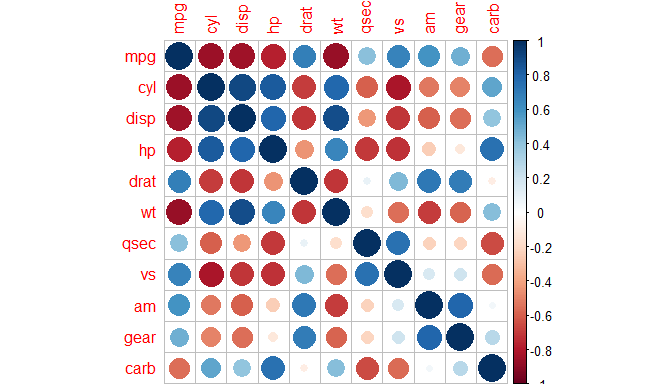

# Analysis of mtcars dataset using Shiny
Nanda kumar Sathiyamoorthy  
August 14, 2017  

## Introduction

- This is the final project of the Developing data products course on Coursera. 

- Here we demonstrate the use of Shiny by building an app to analyse the mtcars dataset. 

- Slidy has been used to create the presentation slides.

- Plotly has been used to make interactive plots in the Shiny application.

## mtcars Dataset

mtcars is an built-in data set in R that has been extracted from the 1974 Motor Trend US magazine, and comprises fuel consumption and 10 aspects of automobile design and performance for 32 automobiles (1973–74 models).


```r
head(mtcars)
```

```
##                    mpg cyl disp  hp drat    wt  qsec vs am gear carb
## Mazda RX4         21.0   6  160 110 3.90 2.620 16.46  0  1    4    4
## Mazda RX4 Wag     21.0   6  160 110 3.90 2.875 17.02  0  1    4    4
## Datsun 710        22.8   4  108  93 3.85 2.320 18.61  1  1    4    1
## Hornet 4 Drive    21.4   6  258 110 3.08 3.215 19.44  1  0    3    1
## Hornet Sportabout 18.7   8  360 175 3.15 3.440 17.02  0  0    3    2
## Valiant           18.1   6  225 105 2.76 3.460 20.22  1  0    3    1
```

## Correlation plot


```r
corrplot(cor(mtcars))
```

<!-- -->

## Shiny Application

The Shiny Application can be found here :

https://nandakumar212.shinyapps.io/DevelopingDataProductsShiny/

- Here we make scatterplots for the variables that user selects.
- Correlation between the selected variables are also calculated and displayed.
- Also, a data table corresponding to the subset of data being analysed is shown.
